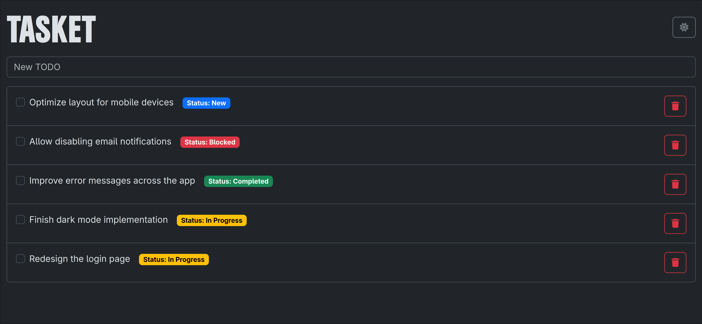

# Tasket

**Tasket** is a lightweight task and ticket tracking app built entirely in **100% Kotlin** – both frontend and backend.
The project demonstrates how a complete, full-stack web application can be developed without leaving the Kotlin
ecosystem.

On the backend, Tasket uses Kotlin with Ktor and Exposed to provide REST endpoints and database access. On the frontend,
it uses KVision and Kotlin/JS (IR backend) to deliver a modern single-page application with reactive UI components.
Shared data models are defined in a common Kotlin module, eliminating the need to duplicate DTOs or manage JSON
serialization manually between languages.

Tasket combines the simplicity of a TODO list with some key aspects of a basic ticket system, including statuses and
threaded comments (with Markdown support). It's ideal as a structured side project or starting point for Kotlin
multiplatform experimentation.

## Features

- Create TODOs with a title and status
- Supported statuses: `New`, `In Progress`, `Blocked`, `Done`
- Add comments to TODOs (with Markdown support and syntax highlighting)
- Server-side validation and persistence
- Clean UI with Bootstrap and Markdown rendering

|      |  |
|:-----------------------------:|:-----------------------------:|
|  |  |

## Tech Stack

### Backend

- **Kotlin** with **Ktor**
- **Exposed** for SQL database access
- **PostgreSQL** as the database
- REST-style endpoints for frontend communication
- Shared data models via a common Kotlin module

### Frontend

- **KVision** for building the frontend UI in pure Kotlin/JS
- **Navigo** for routing
- **Wysimark** for rich Markdown input
- **highlight.js** for syntax highlighting in comments
- **sanitize-html** for XSS-safe HTML rendering
- Shared models via the common module (no duplicated DTOs)

### Build System

- **Gradle** with `buildSrc` for managing versions and plugins
- Kotlin/JS uses the IR backend with `moduleKind = "umd"`

## Running Locally

To build and run Tasket locally, you need a working Java 17+ environment and PostgreSQL installed (alternatively, you
can use the provided Docker Compose file to run PostgreSQL in a container).
The application is structured as a standard Kotlin multiplatform project with separate modules for backend (
`tasket-server`), frontend (`tasket-app`), and shared code (`tasket-shared`).

1. Clone the repository
2. Make sure PostgreSQL is running and configured (default URL: `jdbc:postgresql://localhost:5432/tasket`)
3. Build and run the backend:
    ```bash
    ./gradlew :tasket-server:run -t --quiet
    ```
4. Build and run the frontend:
    ```bash
    ./gradlew jsRun -t --quiet
    ```
   The frontend is served via a development server and can communicate with the backend over HTTP.

   Alternatively, you can configure the backend to serve the compiled JS directly in production.
5. Configure the frontend to point to the backend URL (default: `http://localhost:8080`). Open the JavaScript console
   in your browser to set the backend URL if needed:
    ```javascript
    window.localStorage.setItem("host", "http://localhost:8080");
    ```

---

> [!IMPORTANT]
> This is a personal project with a focus on structure and simplicity.
> Markdown comments, status tracking, and a minimal but responsive UI make it a good base for small internal tools or
> hobby projects.
> It explores the potential of Kotlin Multiplatform for full-stack development, allowing for shared code and models
> between the backend and frontend.
> Do not expect a full-fledged ticketing system; this is a simple, lightweight tool for personal use.
>
> It still needs a lot of work.
